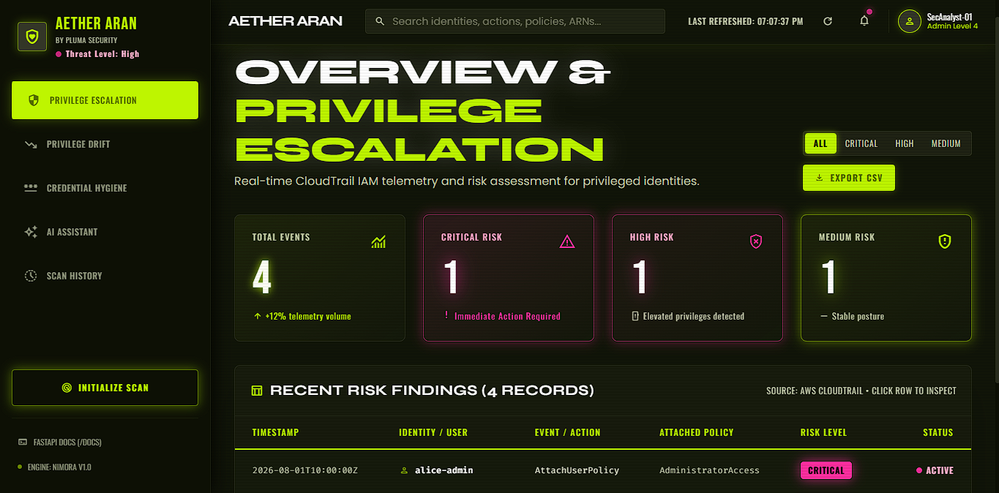
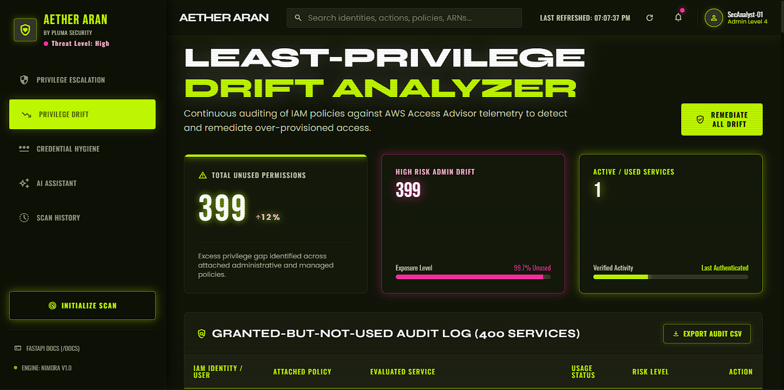
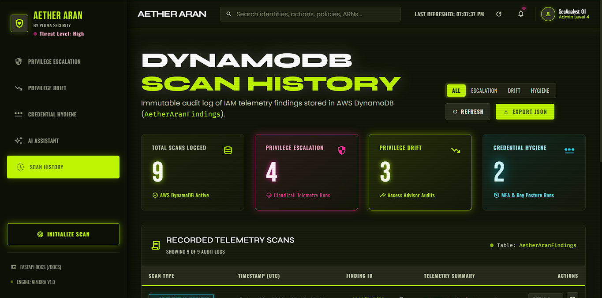

# AETHER ARAN — Cloud IAM Security & Entitlement Management (CIEM)

<div align="center">


**A continuous Cloud Infrastructure Entitlement Management (CIEM) platform that detects IAM privilege escalation, permission drift, and credential hygiene risks in AWS, paired with an AI Security Analyst (NIMORA).**

[Features](#-key-features) • [Tech Stack](#-tech-stack) • [Architecture](#-architecture) • [Getting Started](#-setup-instructions) • [Screenshots](#-screenshots) • [Author](#-about-the-developer)

</div>

---

## 📖 Overview

**AETHER ARAN** (by Pluma Security) is a Cloud Infrastructure Entitlement Management (CIEM) solution engineered to monitor, analyze, and enforce the principle of least privilege across AWS identity environments. 

It provides real-time visibility into high-risk CloudTrail events, flags privilege escalation attempts, cross-references granted permissions against actual usage via AWS Access Advisor, and audits credential postures. All findings are backed by an immutable Amazon DynamoDB audit trail and interactive AI-assisted remediation via **NIMORA** (powered by Google Gemini).

---

## ✨ Key Features

### 1. 🛡️ Privilege Escalation Detector
Ingests and evaluates AWS CloudTrail event streams for unauthorized administrative elevations, privilege escalations (e.g. `AttachUserPolicy`, `PutUserPolicy`, `CreateAccessKey`), and anomalous off-hours activity. Automatically ranks threats by severity (`CRITICAL`, `HIGH`, `MEDIUM`, `LOW`).



---

### 2. 📉 Least-Privilege Drift Analyzer
Compares granted IAM policy permissions against real-world utilization telemetry using AWS Access Advisor. Instantly flags inactive privileges, over-provisioned roles, and granted-but-never-used service actions across your cloud estate.



---

### 3. 🔐 Credential Hygiene Checker
Audits identity hygiene against CIS AWS Foundations benchmarks. Identifies non-MFA compliant accounts, flags unrotated access keys older than 90 days, and tracks privileged AWS Root account access.


---

### 3.5 🛠️ Active Remediation (Safety-Constrained)
Beyond detection, AETHER ARAN can act. Analysts can deactivate stale/rotation-overdue AWS access keys directly from the dashboard (`Status='Inactive'` — reversible, never a permanent delete) and flag non-MFA-compliant identities for compliance follow-up. Every remediation action requires Cognito authentication and is written to an immutable DynamoDB audit trail (who, what, when).

---

### 4. 🤖 NIMORA AI Security Assistant
A specialized SOC AI assistant powered by Google Gemini (Gemini 3.1 Flash Lite). Grounded exclusively in live IAM security telemetry to answer investigative queries, evaluate blast radiuses, draft least-privilege IAM policies, and guide remediation — protected by dual-layer prompt-injection security defenses.


---

### 5. 🗄️ DynamoDB Scan History & Audit Trail
Every security scan run is automatically and immutably persisted into Amazon DynamoDB (`AetherAranFindings`). The platform includes a dedicated Scan History dashboard with color-coded classification, full JSON payload inspection, and instant historical analysis.



---

## 🛠️ Tech Stack

### Frontend
- **Framework**: React 18 (Single Page Application architecture)
- **Build Tool**: Vite (Lightning-fast HMR and production bundling)
- **Styling**: Tailwind CSS with custom glassmorphism design tokens, CSS variables, and CRT scanline overlays
- **Icons & Typography**: Google Material Symbols, Google Fonts (*Syne*, *Bebas Neue*, *Oswald*, *Fira Code*)

### Backend & API
- **Language**: Python 3.10+
- **API Framework**: FastAPI (Asynchronous REST API with auto-generated OpenAPI / Swagger docs)
- **Server**: Uvicorn (ASGI server)
- **Data Processing**: Pandas, Pydantic data schemas, Python standard library

### Cloud & AWS Services
- **AWS SDK**: `boto3` & `botocore`
- **Identity & Access Management**: AWS IAM (Access Advisor, Policies, Roles, Credential Reports)
- **Audit & Telemetry**: AWS CloudTrail & S3 log storage
- **NoSQL Database**: Amazon DynamoDB (`AetherAranFindings` table with Partition Key `finding_id` & Sort Key `scan_id`)
- **Region**: `ap-south-1` (configurable)

### Artificial Intelligence
- **AI Core**: Google Gemini API (`google-genai` SDK)
- **Model**: `gemini-3.1-flash-lite` (with fallback resilience to `gemini-2.5-flash`)
- **Security Defenses**: Heuristic prompt-injection filter + strict system instructions with untrusted data delineation

---

## 🏛️ Architecture

```
┌──────────────────────────────────────────────────────────────────┐
│                   React 18 + Vite Frontend (SOC)                 │
│  ┌──────────────────┐ ┌──────────────────┐ ┌──────────────────┐  │
│  │ Threat Overview  │ │  Drift Analyzer  │ │ Credential Audit │  │
│  └──────────────────┘ └──────────────────┘ └──────────────────┘  │
│  ┌───────────────────────────────────────┐ ┌──────────────────┐  │
│  │ NIMORA AI Assistant (Full-Width Chat) │ │  Scan History DB │  │
│  └───────────────────────────────────────┘ └──────────────────┘  │
└─────────────────────────────────┬────────────────────────────────┘
                                  │ HTTP / REST APIs (Port 8000)
                                  ▼
┌──────────────────────────────────────────────────────────────────┐
│                      FastAPI Backend Engine                      │
│   GET /api/privilege-escalation  •  GET /api/drift-report        │
│   GET /api/credential-hygiene    •  GET /api/scan-history        │
│   POST /api/remediate/access-key • POST /api/remediate/mfa-flag  │
│   POST /api/ai-chat              •  GET /api/health              │
└───────────────────┬──────────────────────────────┬───────────────┘
                    │                              │
        ┌───────────▼───────────┐      ┌───────────▼───────────┐
        │   AWS Cloud Services  │      │    Google Gemini AI   │
        │ • CloudTrail S3 Logs  │      │ • NIMORA Copilot      │
        │ • IAM Access Advisor  │      │ • Contextual Analysis │
        │ • Credential Reports  │      │ • Least-Privilege Gen │
        │ • Amazon DynamoDB     │      └───────────────────────┘
        │   (AetherAranFindings)│
        └───────────────────────┘
```

---

## 🚀 Setup Instructions

### Prerequisites
- **Python**: Version 3.10 or higher
- **Node.js**: Version 18.x or higher & npm
- **AWS Account & CLI**: Configured AWS credentials (`~/.aws/credentials` or environment variables) with permissions for IAM, CloudTrail/S3, and DynamoDB.
- **Google Gemini API Key**: Obtainable from [Google AI Studio](https://aistudio.google.com/).

---

### Step 1: Clone the Repository
```bash
git clone https://github.com/Lee-cloud369/IAM-project.git
cd IAM-project
```

### Step 2: Configure Environment Variables
Create a `.env` file in the root directory:
```env
# Google Gemini API Key for NIMORA AI Assistant
GEMINI_API_KEY=your_gemini_api_key_here

# AWS Configuration (optional if already configured via `aws configure`)
AWS_REGION=ap-south-1
CLOUDTRAIL_BUCKET_NAME=your-cloudtrail-s3-bucket-name
```

### Step 3: Install Backend Dependencies
```bash
# Optional: Create and activate a Python virtual environment
python -m venv .venv
# On Windows:
.venv\Scripts\activate
# On Linux/macOS:
source .venv/bin/activate

# Install required Python packages
pip install -r requirements.txt
```

### Step 4: Install Frontend Dependencies
```bash
cd frontend
npm install
cd ..
```

### Step 5: Run the FastAPI Backend Server
```bash
cd api
python -m uvicorn main:app --reload --port 8000
```
* If `uvicorn` is blocked by Windows security policy (WDAC), always use `python -m uvicorn` instead of the bare `uvicorn` command.
* Interactive Swagger API documentation will be available at: **http://127.0.0.1:8000/docs**

### Step 6: Run the React Frontend Application
Open a new terminal window:
```bash
cd frontend
npm run dev
```
* The SOC Dashboard will be accessible at: **http://localhost:5173**

---

## 📸 Screenshots

<!-- 
Place your application screenshots in the `screenshots/` directory using these exact filenames:
- screenshots/privilege-escalation.png
- screenshots/drift-analyzer.png
- screenshots/credential-hygiene.png
- screenshots/ai-assistant.png
- screenshots/scan-history.png
-->

### 1. Privilege Escalation & Threat Overview

*Real-time CloudTrail threat telemetry, risk ranking, and identity metrics.*

---

### 2. Least-Privilege Drift Analyzer

*AWS Access Advisor usage gap analysis highlighting unused administrative permissions.*

---

### 3. Credential Hygiene Checker

*MFA compliance audit, 90+ day unrotated access keys, and root account activity monitoring.*

---

### 4. NIMORA AI Assistant (ChatGPT-Style Interface)

*Full-width AI assistant analyzing live security telemetry with prompt injection defenses.*

---

### 5. DynamoDB Scan History & Audit Trail

*Immutable DynamoDB audit log table with full JSON finding payloads and one-click AI investigation.*

---

## 🔒 Security Architecture & Production Hardening

This project follows industry-standard **DevSecOps** and **OWASP Top 10** secure coding practices:

### 1. Strict Input Validation & Error Handling
- **Pydantic Models**: All incoming API request bodies and query parameters are strictly typed and constrained (e.g. `/api/ai-chat` enforces length limits between 1 and 1000 characters).
- **HTTP 422 Rejection**: Malformed, empty, or oversized requests are automatically rejected with structured `422 Unprocessable Entity` errors before reaching business logic.
- **Generic Error Responses**: Unhandled 500 exceptions return a generic `{"error": "Something went wrong"}` response to prevent internal stack traces or system paths from leaking to clients.

### 2. Output Encoding & XSS Prevention
- **React Plain Text Escaping**: The **NIMORA AI** chat assistant renders AI responses strictly as plain text (`{msg.text}`) in JSX. It deliberately avoids `dangerouslySetInnerHTML`, ensuring that any HTML tags or script injection attempts in AI-generated text are automatically encoded into harmless text entities.

### 3. Safe Parameterized DynamoDB Queries
- **NoSQL Injection Immunity**: All database interactions with AWS DynamoDB (`put_item`, `scan`) utilize Boto3's native parameterized data structures and typed attribute mappings. No dynamic SQL/NoSQL string concatenation is used anywhere in the codebase.

### 4. Data Protection & Encryption
- **Encryption at Rest**: DynamoDB table `AetherAranFindings` is encrypted at rest by default using **AWS Key Management Service (AWS KMS)** with 256-bit Advanced Encryption Standard (**AES-256**).
- **Encryption in Transit (HTTPS in Production)**:
  > [!IMPORTANT]
  > When deploying **AETHER ARAN IAM** to a production environment:
  > 1. **Enforce HTTPS / TLS 1.3**: Terminate TLS at a reverse proxy (such as Nginx, AWS Application Load Balancer (ALB), or CloudFront) using valid SSL/TLS certificates (e.g. AWS Certificate Manager or Let's Encrypt).
  > 2. **HTTP Strict Transport Security (HSTS)**: Configure `Strict-Transport-Security: max-age=31536000; includeSubDomains; preload` headers to ensure browsers only communicate over encrypted channels.
  > 3. **API Base URL**: Update `VITE_API_URL` in the frontend environment configuration to point to the secure `https://api.yourdomain.com` endpoint.

### 5. API Abuse Prevention & Rate Limiting
- **Rate Limiting (`slowapi`)**: Every API endpoint is guarded with an IP-based rate limit of **30 requests per minute** to prevent brute-force attacks, scraping, and denial-of-service (DoS) attempts.
- **Strict CORS Whitelist**: Cross-Origin Resource Sharing is strictly whitelisted to trusted frontend development ports (`http://localhost:5173`, `http://localhost:3000`). Wildcard `*` origins and open regex patterns are disallowed.

### 6. Centralized & Rotating Secure Logging
- **Audit Logging**: Every API request (timestamp, HTTP method, endpoint path, client IP, HTTP status code, and duration in ms) is logged server-side to `logs/app.log` with automatic file rotation (max 5 MB per file, 3 backups).
- **Credential Protection**: Sensitive authentication tokens, AWS secret keys, and passwords are strictly excluded from all log records.

### 7. AWS Cognito User Authentication & In-Memory Token Management
- **Cognito JWT Verification**: The FastAPI backend integrates with AWS Cognito User Pools (`COGNITO_USER_POOL_ID`), automatically validating RSA cryptographic signatures against the public keys fetched from Cognito's JWKS endpoint (`/.well-known/jwks.json`).
- **Endpoint Protection**: All telemetry and investigation routes (`/api/privilege-escalation`, `/api/drift-report`, `/api/credential-hygiene`, `/api/scan-history`, `/api/ai-chat`, `/api/me`) require a valid `Authorization: Bearer <token>` header.
- **In-Memory Token Storage (XSS Protection)**: The React frontend stores authentication tokens exclusively in React state/context memory (never in `localStorage` or `sessionStorage`), eliminating local token harvesting attacks.
- **Self-Service Analyst Onboarding**: Includes Cyberpunk-themed Login and Sign Up screens with automated email verification code confirmation.

### 8. Safety-Constrained Automated Remediation
- **Reversible-Only Actions**: Remediation endpoints (`/api/remediate/access-key`) exclusively use `iam.update_access_key(Status='Inactive')` — the codebase never calls `delete_access_key` or any irreversible IAM deletion API.
- **No Silent Enforcement**: MFA compliance issues are flagged and logged for human follow-up (`/api/remediate/mfa-flag`), never auto-enforced, since MFA enrollment requires physical device registration by the account owner.
- **Full Audit Trail**: Every remediation action records the performing analyst's identity, timestamp, and justification into DynamoDB.

---

## 💡 Engineering & Learning Journey

> *"Built as part of my Cloud Security learning journey."*

I am a **Cybersecurity undergraduate** with a strong passion for Cloud Security Engineering, Identity & Access Management (IAM) governance, and DevSecOps. 

This project was built to explore real-world challenges in enterprise AWS security: detecting stealthy privilege escalation chains, eliminating excess permissions through Access Advisor telemetry, and utilizing Generative AI safely within security operations. 

Throughout this project, I used modern developer tooling and AI pair-programming to understand each architectural layer thoroughly — from AWS boto3 integrations and FastAPI API design to React state management and DynamoDB persistence.

---

## 👤 About the Developer

**Lingesh (Lee)** — *Cybersecurity Undergraduate & Aspiring Cloud Security Engineer*

- **GitHub**: [@Lee-cloud369](https://github.com/Lee-cloud369)
- **LinkedIn**: [lingesh-pandi-p](https://www.linkedin.com/in/lingesh-pandi-p)

---

## 📄 License
This project is open-source and available under the [MIT License](LICENSE).
